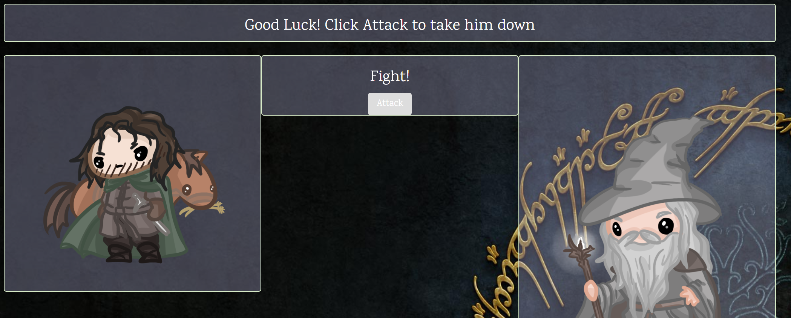

# LOTR Inspired RPG
#### GitHub: https://github.com/erodriguez87/simple-rpg

## Description:
Interacive single player RPG game built using javascript. This was one of my first attempts at logic interacting with the front end. 

The player chooses a character by clicking the a fighter. This will be your character for the entire game. 

The player has to defeat all other characters to win the game. They can can select enemies in the same way that they picked their own character. 

The game includes instructions for playing from that point.

## Built With
- JavaScript - Programming language
- jQuery - Javascript library

## Authors:  
Eddie Rodriguez